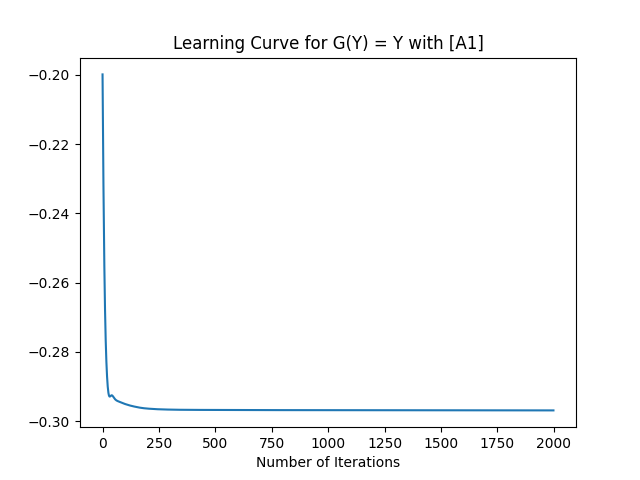
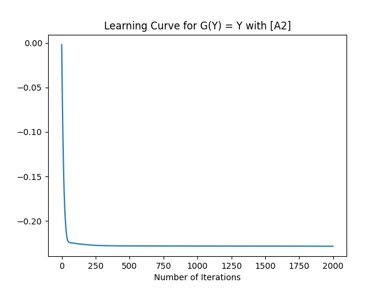
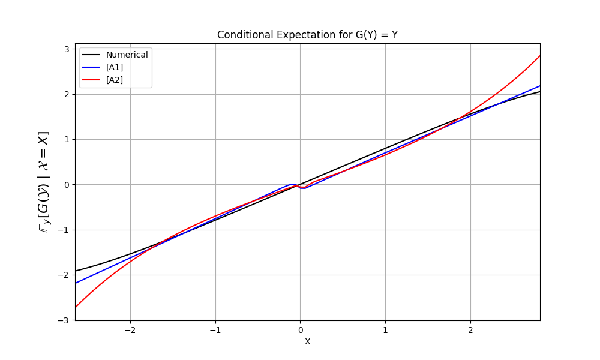
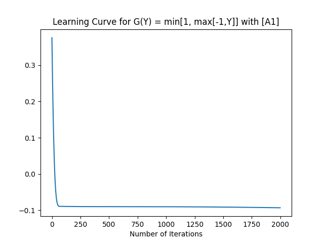
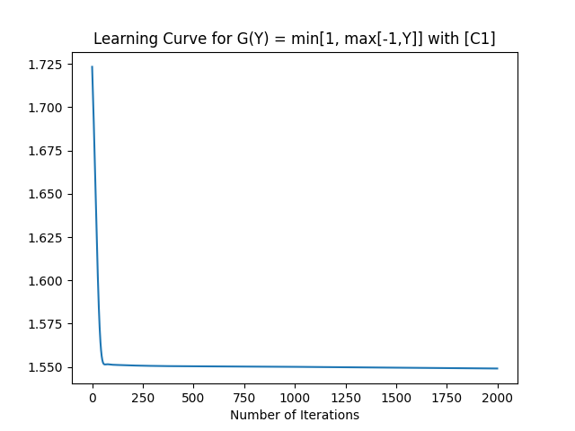
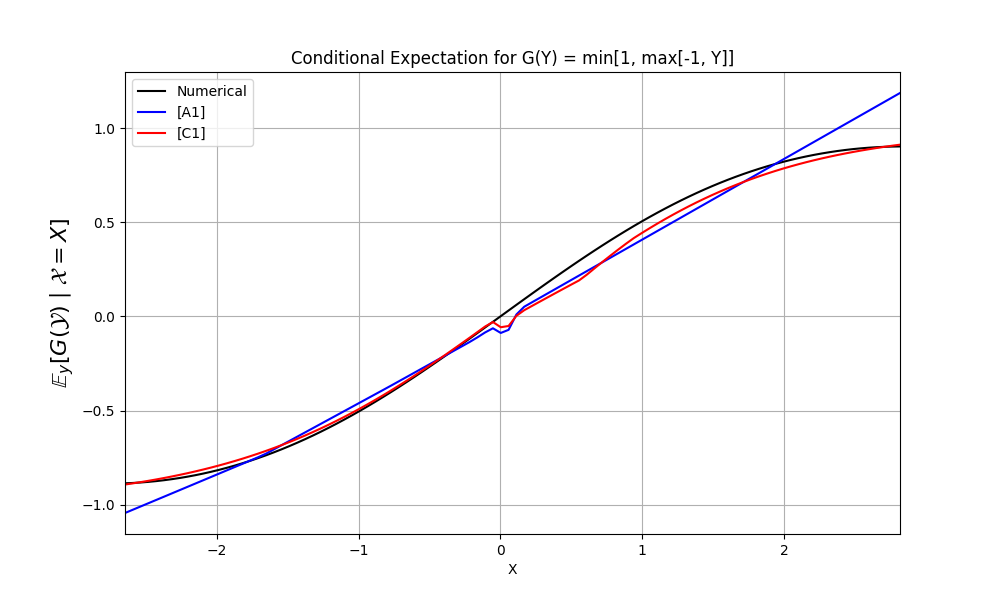

# Conditional Expectation Estimation with Neural Networks

This repository implements the estimation of conditional expectations using neural networks. Specifically, the neural network models are trained to approximate the conditional expectations for different functions \( G(Y) \) given \( X \), using various function families such as [A1], [A2], and [C1]. The code also provides numerical solutions for comparison.

## Overview

The repository consists of the following:

- **Functions**: Several mathematical functions (e.g., \( G(Y) \), \( \omega(z) \), \( \rho(z) \), etc.) are defined to facilitate the estimation of conditional expectations.
- **Neural Network Model**: A feedforward neural network is used to approximate the conditional expectation. The network uses the Adam optimizer and ReLU activation function.
- **Training**: The neural network is trained on a dataset to approximate conditional expectations for different functions.
- **Numerical Solution**: A numerical approach is also implemented to calculate and visualize the conditional expectation for comparison.
- **Plots**: The results are visualized using plots comparing the neural network’s predictions with numerical solutions.

## Mathematical Functions

- **\( H(y | x) \)**: The CDF of \( Y \) given \( X \), modeled using the normal CDF.
- **Activation Functions**: Various functions such as ReLU are used to transform the data within the neural network.
- **Omega, Rho, Phi, Psi**: Different mathematical functions are implemented for different scenarios ([A1], [A2], [C1]).

## Neural Network Architecture

- The network consists of an input layer, a hidden layer, and an output layer.
- The forward pass uses the ReLU activation function.
- The backward pass computes gradients and updates the weights using the Adam optimizer.

## Training

The neural networks are trained using the following parameters:
- **Learning Rate**: 0.001
- **Hidden Size**: 50
- **Epochs**: 2000
- **Optimizer**: Adam with default parameters.

The training loop computes the loss at each epoch and updates the weights accordingly. After training, the network’s performance is visualized.

## Results

The repository contains plots that show the comparison between the neural network predictions and the numerical solutions for various functions \( G(Y) \). The learning curves and results for different functions are plotted to demonstrate the neural network’s ability to approximate conditional expectations.

# Neural Networks for Conditional Expectation

## Learning Curves and Approximations

### Learning Curves for G(Y) = Y

1. **Learning Curve with [A1]** and **Learning Curve with [A2]**:
   

      
      
   

### Approximation for G(Y) = Y

3. **Approximation for G(Y) = Y**:
   

      
   

### Learning Curves for G(Y) = min{1, max{-1,Y}}

4. **Learning Curve with [A1]** and **Learning Curve with [C1]**:
   

      
      
   

### Approximation for G(Y) = min{1, max{-1,Y}}

6. **Approximation for G(Y) = min{1, max{-1,Y}}**:
   

      
   

## Usage

To run the code:

1. Clone the repository:
       git clone https://github.com/orestis-koutroumpas/neural-networks-for-conditional-expectation.git

2. Navigate into the repository directory:

        cd folder-name

3.  Install required dependencies:

        pip install numpy matplotlib scipy

4. Run the main script:

        python main.py

This will train the neural network models and generate the plots.

